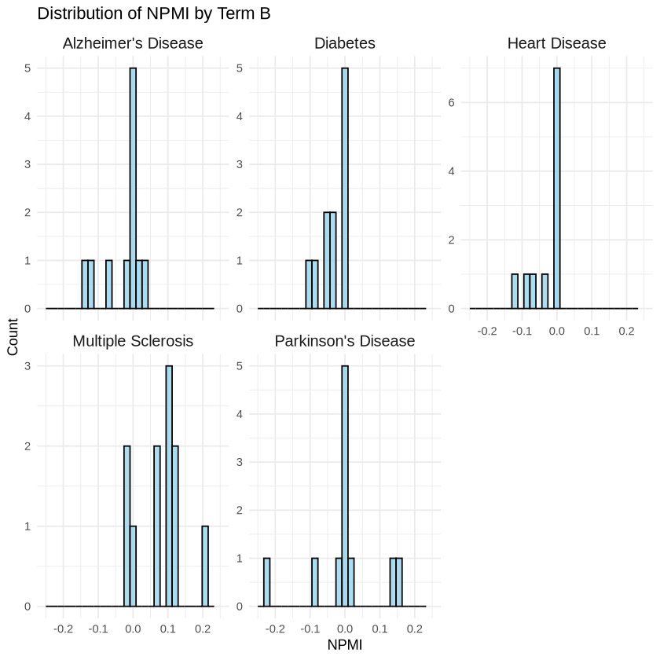

# RelMinerR 
In natural language processing (NLP) and text mining, understanding the relationship between two terms can be crucial for tasks such as knowledge extraction, semantic analysis, and information retrieval. For example, you may want to evaluate how strongly two concepts (such as "Cancer" and "TP53") are related across a large corpus of documents by considering their synonyms. This relationship can be quantified by calculating co-occurrences, Pointwise Mutual Information (PMI), and Normalized Pointwise Mutual Information (NPMI). 


**RelMineR** is an R package designed to facilitate the discovery of potential biomedical relationships between terms using PMI and NPMI scores. 

**Key Features:**

* **Relationship Quantification:** Employs established metrics like co-occurrences, PMI, and NPMI to measure the strength of relationships between terms.
* **PubMed Abstraction:** Leverages a pre-built Elasticsearch index of PubMed abstracts to efficiently search for relevant information.
* **Biomedical Focus:** Tailored to the specific needs of biomedical research, ensuring accurate and meaningful relationship discovery.

**How it Works:**

1. **Elasticsearch Integration:** RelMineR seamlessly connects to a pre-configured Elasticsearch index containing PubMed abstracts.
3. **Relationship Quantification:** Calculates metrics such as PMI and NPMI to quantify the strength of these relationships.
4. **API Access:** Provides a user-friendly API that allows researchers to query the system for potential relationships between terms of interest.

**Note:** Detailed instructions for building the Elasticsearch index of PubMed abstracts will be available in a separate GitHub repository.

By utilizing RelMineR, researchers can gain valuable insights into the connections between biomedical concepts, accelerating their understanding of complex biological processes and facilitating the discovery of new knowledge.


# Background

## Pointwise Mutual Information (PMI)

PMI is a measure of the association between two terms based on their co-occurrence. It quantifies how much more likely two terms are to co-occur than would be expected by chance. PMI is used widely in the field of information theory and computational linguistics to quantify the strength of association between two terms. It was initially proposed by [Church and Hanks (1990)](https://aclanthology.org/J90-1003.pdf) as a way to measure word associations in corpora.

$$
\text{PMI}(A, B) = \log \frac{P(A, B)}{P(A) \cdot P(B)}
$$

Where:
- P(A, B)  is the probability that both terms A and B occur together (co-occurrence).
- P(A)  is the probability that term A occurs.
- P(B)  is the probability that term B occurs.

## PMI in Terms of Document Counts

When working with document counts in a corpus, PMI can be expressed as:

$$
\text{PMI}(A, B) = \log \frac{\frac{n_{AB}}{N}}{\left(\frac{n_A}{N}\right) \cdot \left(\frac{n_B}{N}\right)}
$$

Where:
- n_{AB} is the number of documents where both A and B occur (co-occurrence).
- n_A is the number of documents where A occurs.
- n_B is the number of documents where B occurs.
- N is the total number of documents.

## Normalized Pointwise Mutual Information (nPMI)

nPMI is a normalized version of PMI that scales the values between -1 and 1. It is used to account for the fact that PMI tends to increase with rarer terms. It was first implemented by [Bouma (2009)](https://www.semanticscholar.org/paper/Normalized-(pointwise)-mutual-information-in-Bouma/15218d9c029cbb903ae7c729b2c644c24994c201). 


$$
\text{nPMI}(A, B) = \frac{\text{PMI}(A, B)}{-\log P(A, B)}
$$

Or in terms of document counts:

$$
\text{nPMI}(A, B) = \frac{\log \frac{P(A, B)}{P(A) \cdot P(B)}}{-\log P(A, B)}
$$

Where:
- P(A, B) is the probability of co-occurrence of A and B, as defined above.

## Additional Notes:

- PMI is positive if the two terms co-occur more often than expected by chance, negative if they co-occur less often, and zero if they are independent.
- nPMI normalizes PMI and ranges from -1 to 1, where:
  - 1 indicates perfect co-occurrence (always occur together).
  - 0 indicates independence (no association).
  - -1 indicates that the terms never co-occur.

These formulas are essential when analyzing the relationship between terms using co-occurrence data.

## Select application to biomedical research 

### Stress response pathways
[Chambers et al. (2024)](https://doi.org/10.1021/acs.chemrestox.3c00335.) have used the approach to find chemicals that induce adaptive stress response pathways (SRPs) by applying Pointwise Mutual Information (PMI) and Normalized Pointwise Mutual Information (NPMI), as described in Chambers et al. (2024). SRPs are essential for restoring cellular homeostasis following perturbation, and when disrupted beyond critical thresholds, they can lead to apoptosis, autophagy, or cellular senescence. These pathways are key indicators for therapeutic interventions and biomarkers of toxicity.

## References

[Church, Kenneth, and Patrick Hanks. “Word Association Norms, Mutual Information, and Lexicography.” Computational Linguistics 16, no. 1 (1990): 22–29.](https://aclanthology.org/J90-1003.pdf)

[Bouma, Gerlof. “Normalized (Pointwise) Mutual Information in Collocation Extraction.” Proceedings of GSCL 30 (2009): 31–40.](https://www.semanticscholar.org/paper/Normalized-(pointwise)-mutual-information-in-Bouma/15218d9c029cbb903ae7c729b2c644c24994c201)

[Chambers, Bryant A., Danilo Basili, Laura Word, Nancy Baker, Alistair Middleton, Richard S. Judson, and Imran Shah. “Searching for LINCS to Stress: Using Text Mining to Automate Reference Chemical Curation.” Chemical Research in Toxicology 37, no. 6 (June 17, 2024): 878–93.](https://doi.org/10.1021/acs.chemrestox.3c00335.)


# Installation

devtools::install_github("https://github.com/i-shah/relminer.git")

# Usage examples

## Relationship between any two terms 

You want to evaluate how strongly two concepts (such as "Cancer" and "TP53") are related across a large corpus of documents. 

1. Create an list to store relevant information to connect to the ElasticSearch server running on localhost at port 9200. 


```R
library(RelMineR)
RM0 <- create_relminer(host='localhost',port = 9200,index='pubmed')

```

2. Use the `count_occurrence` function to count the number of abstracts with Cancer or TP53


```R
count_occurrences(terms = c('Cancer'),relminer = RM0)
```


1522097


```R
count_occurrences(terms = c('TP53'),relminer = RM0)
```


16073


3. Use the `count_cooccurrence` function to count the number of abstracts with Cancer and TP53


```R
count_cooccurrences(terms_A = c('Cancer'),terms_B=c('TP53'),relminer = RM0)
```


8884


4. Use the `count_cooccurrence` function to count the number of abstracts with Cancer and TP53 as well as their potential synonyms


```R
count_cooccurrences(terms_A = c('Cancer','neoplasia','neoplasm'),terms_B=c('TP53','P53'),relminer = RM0)
```


44707


Using synonyms in information retrieval or text mining helps you get more hits because different terms or expressions can refer to the same concept. In scientific literature, common names, abbreviations, or alternate descriptions are frequently used to refer to the same entity, such as genes, chemicals, or diseases. By incorporating synonyms, you broaden the scope of the search and increase the likelihood of matching relevant documents.

5. Calculate the PMI and NPMI using the `find_rels` function, which require the terms to be structured as named list


```R
gene <- create_term('p53',c('P53','TP53'),'gene')
disease <- create_term('Cancer',c('Cancer','neoplasia','neoplasm'),'disease')

find_rel(gene,disease,relminer = RM0)
```


<table class="dataframe">
<caption>A data.frame: 1 × 10</caption>
<thead>
	<tr><th scope=col>term_a</th><th scope=col>term_b</th><th scope=col>class_a</th><th scope=col>class_b</th><th scope=col>count_a</th><th scope=col>count_b</th><th scope=col>count_ab</th><th scope=col>count_docs</th><th scope=col>pmi</th><th scope=col>npmi</th></tr>
	<tr><th scope=col>&lt;chr&gt;</th><th scope=col>&lt;chr&gt;</th><th scope=col>&lt;chr&gt;</th><th scope=col>&lt;chr&gt;</th><th scope=col>&lt;int&gt;</th><th scope=col>&lt;int&gt;</th><th scope=col>&lt;int&gt;</th><th scope=col>&lt;int&gt;</th><th scope=col>&lt;dbl&gt;</th><th scope=col>&lt;dbl&gt;</th></tr>
</thead>
<tbody>
	<tr><td>p53</td><td>Cancer</td><td>gene</td><td>disease</td><td>95237</td><td>1572923</td><td>44707</td><td>20688473</td><td>2.626286</td><td>0.2966177</td></tr>
</tbody>
</table>


### Explanation of the find_rels output:-

This represents the **co-occurrence analysis** between two terms, in this case **p53** and **Cancer**, across a PubMed abstracts documents. The columns in the `data.frame` contain various statistics about the terms' individual occurrences, their joint occurrences, and measures of their association based on co-occurrence analysis.

#### Column Descriptions:
- **`term_a`**: The first term in the analysis **p53**
  
- **`term_b`**: The second term in the analysis **Cancer**

- **`class_a`**: The category or class to which `term_a` belongs. Here, `p53` is defined (by the user) as a **gene**.

- **`class_b`**: The category or class to which `term_b` belongs. Here, `Cancer` is classified as a **disease**.

- **`count_a`**: The total number of documents in the corpus where `term_a` (p53) occurs. In this case, **95,237** documents mention p53.

- **`count_b`**: The total number of documents in the corpus where `term_b` (Cancer) occurs. In this case, **1,572,923** documents mention Cancer.

- **`count_ab`**: The total number of documents where both `term_a` (p53) and `term_b` (Cancer) co-occur together. In this case, **44,707** documents mention both p53 and Cancer.
- **`count_docs`**: The total number of abstracts in the index

- **`pmi`**: The **Pointwise Mutual Information (PMI)** score, which measures the strength of association between `term_a` and `term_b` based on their co-occurrence. A higher PMI score indicates that the two terms co-occur more often than would be expected by chance. In this case, the PMI score of **2.626286** suggests that p53 and Cancer co-occur more frequently than random chance would suggest.

- **`npmi`**: The **Normalized Pointwise Mutual Information (NPMI)** score, which normalizes the PMI score to a value between -1 and 1. An NPMI value closer to **1** indicates a strong positive association (the terms frequently co-occur), **0** indicates independence (the terms occur together at random), and **-1** indicates a strong negative association (the terms never co-occur). In this case, the NPMI score of **0.2966177** suggests a moderate positive association between p53 and Cancer.

### Interpretation:
- The data suggests that **p53** (a gene) and **Cancer** (a disease) co-occur in **44,707** documents out of a corpus, with **95,237** documents mentioning p53 and **1,572,923** mentioning Cancer.
- The **PMI score of 2.63** indicates that p53 and Cancer co-occur more frequently than expected by chance.
- The **NPMI score of 0.30** suggests a moderate association between the two terms, meaning that p53 is frequently mentioned in the context of Cancer in the documents analyzed.

This suggests a potential relationship between the gene **p53** and **Cancer**, providing insights into how often they co-occur and how strongly they are associated in the analyzed corpus of documents. 


## Relationships between chemicals and diseases

This second use case aims to uncover relationships between thousands of chemicals and hundreds of diseases by leveraging co-occurrence analysis and statistical association measures PMI and NPMI. This task is a littler more involved due to the scale of the input terms.


1. Load chemicals and store them in a list


```R
Chems <- read.csv("../data/chem.tsv",sep='\t',quote="\"")
#save(Chems, file = "../data/chems.rda")
```


```R
Chems[sample(1:nrow(Chems),1),]
```


<table class="dataframe">
<caption>A data.frame: 1 × 3</caption>
<thead>
	<tr><th></th><th scope=col>name</th><th scope=col>class</th><th scope=col>synonyms</th></tr>
	<tr><th></th><th scope=col>&lt;chr&gt;</th><th scope=col>&lt;chr&gt;</th><th scope=col>&lt;chr&gt;</th></tr>
</thead>
<tbody>
	<tr><th scope=row>43</th><td>Chlordiazepoxide hydrochloride</td><td>chemical</td><td>C16H14ClN3O.HCl|Ansiacal|Chlordiazachel|NSC-115748|Chlordiazepoxide hydrochloride [USAN:USP:BAN:JAN]|SK-Lygen|Chlordiazepoxide hydrochloride, United States Pharmacopeia (USP) Reference Standard|CHLORDIAZEPOXIDE HYDROCHLORIDE CIV|AKOS015895152|Librium|Labican|Napoton hydrochloride|Lygen|Chlorodiazepoxide hydrochloride|D00693|Clopoxide chloride|Chlordiazepoksid|NSC 115748|(1E,4E)-7-chloro-2-(methylamino)-5-phenyl-3H-benzo[e][1,4]diazepine 4-oxide hydrochloride|Psichial|Droxol hydrochloride|Chlordiazepoxide monohydrochloride|Lentotran|CHLORDIAZEPOXIDE HYDROCHLORIDE CIV [USP-RS]|Reliberan|component of Librax|Calmoden|Chlordiazepoxide hydrochloride [USAN:BAN:JAN]|MFM6K1XWDK|Librium, hydrochloride|CHLORDIAZEPOXIDE HYDROCHLORIDE [EP MONOGRAPH]|Librium (TN)|Trakipeal|Methaminodiazepine hydrochloride|Chlordiazepoxide hydrochloride (JAN/USP)|C16H14ClN3O.ClH|EINECS 207-117-8|NSC115748|CHLORDIAZEPOXIDE HYDROCHLORIDE [USP MONOGRAPH]|7-Chloro-2-(methylamino)-5-phenyl-3H-1,4-benzodiazepine 4-oxide monohydrochloride|Timosin|CHLORDIAZEPOXIDE HYDROCHLORIDE [WHO-DD]|Librium hydrochloride|C16-H14-Cl-N3-O.Cl-H|Viansin|A-Poxide|Diazachel (Obs.)|3H-1,4-Benzodiazepin-2-amine, 7-chloro-N-methyl-5-phenyl-, 4-oxide, monohydrochloride|CHEMBL1200703|Equibral|C-2992|3H-1,4-Benzodiazepine, 7-chloro-2-methylamino-5-phenyl-, 4-oxide, monohydrochloride|438-41-5|Sophiamin|Ro-5-0690|7-Chloro-2-(methylamino)-5-phenyl-3H-1,4-benzodiazepine-4-oxide hydrochloride|Chlordiazepoxide hydrochloride, European Pharmacopoeia (EP) Reference Standard|7-Chloro-2-(methylamino)-5-phenyl-3H-1, 4-oxide, hydrochloride|J-Liberty|CHLORDIAZEPOXIDE HYDROCHLORIDE [ORANGE BOOK]|Novosed|Risachief hydrochloride|CHLORDIAZEPOXIDE HYDROCHLORIDE [JAN]|Cebrum|Retcol|CHLORDIAZEPOXIDE HYDROCHLORIDE [VANDF]|SCHEMBL8935|CHEBI:3612|CHLORDIAZEPOXIDE HYDROCHLORIDE|LS-34065|Libritabs hydrochloride|CHLORDIAZEPOXIDE HYDROCHLORIDE [USP-RS]|Seren vita|Contol|Ro 5-0690|3H-1, 7-chloro-N-methyl-5-phenyl-, 4-oxide, monohydrochloride|Methaminodiazepoxide hydrochloride|CHLORDIAZEPOXIDE HYDROCHLORIDE [USAN]|WLN: T67 GN JN IHJ CG HM1 JO KR &amp;GH|UNII-MFM6K1XWDK|Chlordiazepoxide hydrochloride|7-chloro-2-(methylamino)-5-phenyl-3H-benzo[e][1,4]diazepine 4-oxide hydrochloride|CHLORDIAZEPOXIDE HYDROCHLORIDE [MART.]|7-chloro-4-hydroxy-N-methyl-5-phenyl-3H-1,4-benzodiazepin-2-imine;hydrochloride|Protensin|3H-1, 7-chloro-2-(methylamino)-5-phenyl-, 4-oxide, monohydrochloride|Chlordiazepoxide hydrochloride, drug standard, 1.0 mg/mL in methanol|Tensinyl|Benzodiapin|Q27106148|Murcil|Chloridiazepoxide hydrochloride|Chlordiazepoxide Hcl|CHLORDIAZEPOXIDE HYDROCHLORIDE [MI]</td></tr>
</tbody>
</table>


```R
create_entity_from_row <- function(row) {
  list(
    name = row["name"],
    class = row["class"],
    synonyms = strsplit(row["synonyms"], "\\|")[[1]]  # Split synonyms by '|'
  )
}

```


```R
chem_ents <- apply(Chems, 1, create_entity_from_row)
```

2. Load diseases


```R
Diseases <- read.csv("../data/disease.tsv",sep='\t',quote="\"")
```


```R
Diseases
```


<table class="dataframe">
<caption>A data.frame: 5 × 4</caption>
<thead>
	<tr><th scope=col>name</th><th scope=col>class</th><th scope=col>synonyms</th><th scope=col>Synonyms</th></tr>
	<tr><th scope=col>&lt;chr&gt;</th><th scope=col>&lt;chr&gt;</th><th scope=col>&lt;chr&gt;</th><th scope=col>&lt;chr&gt;</th></tr>
</thead>
<tbody>
	<tr><td>Parkinson's Disease</td><td>disease</td><td>Parkinson|Parkinson's Disease|Shaking Palsy|Paralysis Agitans|Substantia Nigra Degeneration</td><td>['Shaking Palsy', 'Paralysis Agitans', 'Substantia Nigra Degeneration']</td></tr>
	<tr><td>Alzheimer's Disease</td><td>disease</td><td>Alzheimer's Disease|Senile Dementia|Alzheimer's Dementia|Memory Loss                       </td><td>['Senile Dementia', "Alzheimer's Dementia", 'Memory Loss']             </td></tr>
	<tr><td>Multiple Sclerosis </td><td>disease</td><td>Multiple Sclerosis|MS|Disseminated Sclerosis|Multiple Sclerosis                            </td><td>['MS', 'Disseminated Sclerosis', 'Multiple Sclerosis']                 </td></tr>
	<tr><td>Diabetes           </td><td>disease</td><td>Diabetes|Diabetes Mellitus|Sugar Diabetes|Hyperglycemia                                    </td><td>['Diabetes Mellitus', 'Sugar Diabetes', 'Hyperglycemia']               </td></tr>
	<tr><td>Heart Disease      </td><td>disease</td><td>Heart Disease|Coronary Artery Disease|Cardiovascular Disease|Heart Attack                  </td><td>['Coronary Artery Disease', 'Cardiovascular Disease', 'Heart Attack']  </td></tr>
</tbody>
</table>


```R
dis_ents <- apply(Diseases, 1, create_entity_from_row)
```

3. Count all cooccurrences


```R
R1 <- find_rels(chem_ents[20:30],dis_ents,RM0)
```


```R
head(R1)
```


<table class="dataframe">
<caption>A data.frame: 6 × 10</caption>
<thead>
	<tr><th></th><th scope=col>term_a</th><th scope=col>term_b</th><th scope=col>class_a</th><th scope=col>class_b</th><th scope=col>count_a</th><th scope=col>count_b</th><th scope=col>count_ab</th><th scope=col>count_docs</th><th scope=col>pmi</th><th scope=col>npmi</th></tr>
	<tr><th></th><th scope=col>&lt;chr&gt;</th><th scope=col>&lt;chr&gt;</th><th scope=col>&lt;chr&gt;</th><th scope=col>&lt;chr&gt;</th><th scope=col>&lt;int&gt;</th><th scope=col>&lt;int&gt;</th><th scope=col>&lt;int&gt;</th><th scope=col>&lt;int&gt;</th><th scope=col>&lt;dbl&gt;</th><th scope=col>&lt;dbl&gt;</th></tr>
</thead>
<tbody>
	<tr><th scope=row>name</th><td>Ethylene thiourea </td><td>Parkinson's Disease</td><td>chemical</td><td>disease</td><td>  277</td><td>92166</td><td>  1</td><td>20688473</td><td>-0.3033654</td><td>-0.01248298</td></tr>
	<tr><th scope=row>name1</th><td>Cyfluthrin        </td><td>Parkinson's Disease</td><td>chemical</td><td>disease</td><td>  611</td><td>92166</td><td>  0</td><td>20688473</td><td> 0.0000000</td><td> 0.00000000</td></tr>
	<tr><th scope=row>name2</th><td>Tretinoin         </td><td>Parkinson's Disease</td><td>chemical</td><td>disease</td><td>23805</td><td>92166</td><td>126</td><td>20688473</td><td> 0.2486797</td><td> 0.01435377</td></tr>
	<tr><th scope=row>name3</th><td>Diethylstilbestrol</td><td>Parkinson's Disease</td><td>chemical</td><td>disease</td><td> 2295</td><td>92166</td><td>  3</td><td>20688473</td><td>-1.7689391</td><td>-0.07786728</td></tr>
	<tr><th scope=row>name4</th><td>Dieldrin          </td><td>Parkinson's Disease</td><td>chemical</td><td>disease</td><td> 1364</td><td>92166</td><td> 49</td><td>20688473</td><td> 3.0114587</td><td> 0.16114731</td></tr>
	<tr><th scope=row>name5</th><td>Flubendiamide     </td><td>Parkinson's Disease</td><td>chemical</td><td>disease</td><td>  174</td><td>92166</td><td>  0</td><td>20688473</td><td> 0.0000000</td><td> 0.00000000</td></tr>
</tbody>
</table>


4. Visualize the distribution of hits by disease


```R
library(ggplot2)

# Assuming your data.frame is named df, which contains the columns as described

# Create the ggplot with fixed number of bins and x-axis range from -1 to 1
ggplot(R1, aes(x = npmi)) +
  geom_histogram(bins = 30, fill = "skyblue", color = "black", alpha = 0.7) +  # 30 bins, adjust as needed
  facet_wrap(~ term_b, scales = "free_y") +  # Facet by term_b, free y-axis scaling
  scale_x_continuous(limits = c(-0.25, 0.25)) +  # Set x-axis range from -1 to 1
  labs(title = "Distribution of NPMI by Term B",
       x = "NPMI",
       y = "Count") +
  theme_minimal() +
  theme(strip.text = element_text(size = 12))  # Customize facet label size

```

    Warning message:
    “Removed 10 rows containing missing values or values outside the scale range
    (`geom_bar()`).”


    

    


5. Pick the top hits for each disease


```R
subset(R1,npmi>0.1)
```


<table class="dataframe">
<caption>A data.frame: 8 × 10</caption>
<thead>
	<tr><th></th><th scope=col>term_a</th><th scope=col>term_b</th><th scope=col>class_a</th><th scope=col>class_b</th><th scope=col>count_a</th><th scope=col>count_b</th><th scope=col>count_ab</th><th scope=col>count_docs</th><th scope=col>pmi</th><th scope=col>npmi</th></tr>
	<tr><th></th><th scope=col>&lt;chr&gt;</th><th scope=col>&lt;chr&gt;</th><th scope=col>&lt;chr&gt;</th><th scope=col>&lt;chr&gt;</th><th scope=col>&lt;int&gt;</th><th scope=col>&lt;int&gt;</th><th scope=col>&lt;int&gt;</th><th scope=col>&lt;int&gt;</th><th scope=col>&lt;dbl&gt;</th><th scope=col>&lt;dbl&gt;</th></tr>
</thead>
<tbody>
	<tr><th scope=row>name4</th><td>Dieldrin         </td><td>Parkinson's Disease</td><td>chemical</td><td>disease</td><td>1364</td><td> 92166</td><td>49</td><td>20688473</td><td>3.011459</td><td>0.1611473</td></tr>
	<tr><th scope=row>name10</th><td>Buspirone        </td><td>Parkinson's Disease</td><td>chemical</td><td>disease</td><td>1199</td><td> 92166</td><td>32</td><td>20688473</td><td>2.582761</td><td>0.1338057</td></tr>
	<tr><th scope=row>name22</th><td>Ethylene thiourea</td><td>Multiple Sclerosis </td><td>chemical</td><td>disease</td><td> 277</td><td>352860</td><td>27</td><td>20688473</td><td>2.514733</td><td>0.1286477</td></tr>
	<tr><th scope=row>name23</th><td>Cyfluthrin       </td><td>Multiple Sclerosis </td><td>chemical</td><td>disease</td><td> 611</td><td>352860</td><td>54</td><td>20688473</td><td>2.373446</td><td>0.1279663</td></tr>
	<tr><th scope=row>name26</th><td>Dieldrin         </td><td>Multiple Sclerosis </td><td>chemical</td><td>disease</td><td>1364</td><td>352860</td><td>92</td><td>20688473</td><td>1.983521</td><td>0.1115669</td></tr>
	<tr><th scope=row>name27</th><td>Flubendiamide    </td><td>Multiple Sclerosis </td><td>chemical</td><td>disease</td><td> 174</td><td>352860</td><td>13</td><td>20688473</td><td>2.131084</td><td>0.1034412</td></tr>
	<tr><th scope=row>name29</th><td>Chlordecone      </td><td>Multiple Sclerosis </td><td>chemical</td><td>disease</td><td> 224</td><td>352860</td><td>17</td><td>20688473</td><td>2.153695</td><td>0.1065402</td></tr>
	<tr><th scope=row>name31</th><td>Picoxystrobin    </td><td>Multiple Sclerosis </td><td>chemical</td><td>disease</td><td>  59</td><td>352860</td><td>19</td><td>20688473</td><td>4.238872</td><td>0.2113687</td></tr>
</tbody>
</table>


### Interpretation
There is evidence linking **dieldrin** and **buspirone** to Parkinson's disease, although the relationships are different in nature.

**Dieldrin and Parkinson's Disease**:
   Dieldrin is a pesticide that has been studied for its neurotoxic effects, particularly in relation to Parkinson's disease (PD). [Research](https://academic.oup.com/toxsci/article/196/1/99/7247543) shows that exposure to dieldrin can contribute to the degeneration of dopaminergic neurons, which is a hallmark of Parkinson's disease. Animal studies have demonstrated that dieldrin exposure increases the release of dopamine and can induce neurodegeneration, potentially triggering or exacerbating Parkinsonian symptoms.


 **Buspirone and Parkinson's Disease**:
   Buspirone is an anti-anxiety medication often prescribed for generalized anxiety disorder. It has been tested in clinical trials to assess its effectiveness in treating anxiety in Parkinson’s patients. Although buspirone has shown some efficacy in reducing anxiety in individuals with Parkinson's, its tolerability is a concern. [In a Phase II trial, 53% of patients experienced worsening motor symptoms while on buspirone, and a significant portion of patients discontinued the medication due to side effects](https://www.sciencedirect.com/science/article/abs/pii/S1353802020308117#!).


## Get abstracts with possible relationships

Now that you have identified potential relationships between chemicals and diseases (or other entities), the next step is to retrieve more detailed information, such as specific scientific articles related to these relationships. You can use the find_abstracts function to pull the PMID, title, and abstract of the relevant articles for further evaluation. This process will help you review the original research and validate the connections between the identified terms.

The find_abstracts function searches through a corpus (such as PubMed) and returns a list of abstracts that contain the terms you're interested in. These abstracts provide insight into how the terms (chemicals and diseases) are discussed in the literature, allowing you to further analyze and understand the context of their relationships. The returned abstracts can then be examined for deeper relevance, quality, and importance to your research goals.

In the example code below, we use the find_abstracts function to get the abstracts for dieldrin and Parkinsons.


```R
1. The terms
```


```R
result <- Filter(function(i) i$name == "Dieldrin", chem_ents)
                 
```


```R
A<-result[[1]]
B<-dis_ents[[1]]

```


```R
2. The query
```


```R
X <- find_abstracts(A,B,RM0)
```


```R
3. Result
```


```R
X[1:3,]
```


<table class="dataframe">
<caption>A data.frame: 3 × 3</caption>
<thead>
	<tr><th></th><th scope=col>pmid</th><th scope=col>title</th><th scope=col>abstract</th></tr>
	<tr><th></th><th scope=col>&lt;list&gt;</th><th scope=col>&lt;list&gt;</th><th scope=col>&lt;list&gt;</th></tr>
</thead>
<tbody>
	<tr><th scope=row>1</th><td>22191981</td><td>Organochlorine insecticides lindane and dieldrin and their binary mixture disturb calcium homeostasis in dopaminergic PC12 cells.</td><td>Current hypotheses link long-term environmental exposure of humans to persistent organochlorine (OC) insecticides lindane (HCH) and dieldrin (HEOD) to the development of neurodegenerative disorders, such as Parkinson's disease. Primary adverse neurological effects of these insecticides are directed at inhibition of GABA(A) and glycine receptors, although GABA-independent effects have also been reported. In this paper we describe the effect of dieldrin and a binary mixture of dieldrin and lindane on a critical parameter of neuronal function and survival, i.e., intracellular calcium homeostasis. The intracellular calcium concentration ([Ca(2+)](i)) has been monitored using real-time single-cell fluorescence microscopy in dopaminergic PC12 cells loaded with the calcium-sensitive dye Fura-2. The results demonstrate that nanomolar concentrations of dieldrin time- and concentration-dependently inhibit depolarization-evoked influx of Ca(2+). Co-exposure of PC12 cells to a mixture of dieldrin and lindane revealed an additive inhibition of the depolarization-evoked increase in [Ca(2+)](i), whereas the lindane-induced increase in basal [Ca(2+)](i) is inhibited by dieldrin. The combined findings indicate that dieldrin and binary mixtures of organochlorines affect [Ca(2+)](i) already at concentrations below commonly accepted effect concentrations and close to human internal dose levels. Consequently, current findings illustrate the need to take mixtures of OC insecticides into account in human risk assessment.</td></tr>
	<tr><th scope=row>2</th><td>18945348</td><td>Environmental neurotoxin dieldrin induces apoptosis via caspase-3-dependent proteolytic activation of protein kinase C delta (PKCdelta): Implications for neurodegeneration in Parkinson's disease.</td><td>In previous work, we investigated dieldrin cytotoxicity and signaling cell death mechanisms in dopaminergic PC12 cells. Dieldrin has been reported to be one of the environmental factors correlated with Parkinson's disease and may selectively destroy dopaminergic neurons. Here we further investigated dieldrin toxicity in a dopaminergic neuronal cell model of Parkinson's disease, namely N27 cells, using biochemical, immunochemical, and flow cytometric analyses. In this study, dieldrin-treated N27 cells underwent a rapid and significant increase in reactive oxygen species followed by cytochrome c release into cytosol. The cytosolic cytochrome c activated caspase-dependent apoptotic pathway and the increased caspase-3 activity was observed following a 3 hr dieldrin exposure in a dose-dependent manner. Furthermore, dieldrin caused the caspase-dependent proteolytic cleavage of protein kinase C delta (PKCδ) into 41 kDa catalytic and 38 kDa regulatory subunits in N27 cells as well as in brain slices. PKCδ plays a critical role in executing the apoptotic process in dieldrin-treated dopaminergic neuronal cells because pretreatment with the PKCδ inhibitor rottlerin, or transfection and over-expression of catalytically inactive PKCδ(K)³⁷⁶(R), significantly attenuates dieldrin-induced DNA fragmentation and chromatin condensation. Together, we conclude that caspase-3-dependent proteolytic activation of PKCδ is a critical event in dieldrin-induced apoptotic cell death in dopaminergic neuronal cells.</td></tr>
	<tr><th scope=row>3</th><td>28192238</td><td>Molecular networks related to the immune system and mitochondria are targets for the pesticide dieldrin in the zebrafish (Danio rerio) central nervous system.</td><td>The objectives of this study were to determine the behavioral and molecular responses in the adult zebrafish (Danio rerio) central nervous system (CNS) following a dietary exposure to the pesticide dieldrin. Zebrafish were fed pellets spiked with 0.03, 0.15, or 1.8μg/g dieldrin for 21days. Behavioral analysis revealed no difference in exploratory behaviors or those related to anxiety. Transcriptional networks for T-cell aggregation and selection were decreased in expression suggesting an immunosuppressive effect of dieldrin, consistent with other studies investigating organochlorine pesticides. Processes related to oxidative phosphorylation were also differentially affected by dieldrin. Quantitative proteomics (iTRAQ) using a hybrid quadrupole-Orbitrap identified 226 proteins that were different following one or more doses. These proteins included ATP synthase subunits (mitochondrial) and hypoxia up-regulated protein 1 which were decreased and NADH dehydrogenases (mitochondrial) and signal recognition particle 9 which were up-regulated. Thus, proteins affected were functionally associated with the mitochondria and a protein network analysis implicated Parkinson's disease (PD) and Huntington's disease as diseases associated with altered proteins. Molecular networks related to mitochondrial dysfunction and T-cell regulation are hypothesized to underlie the association between dieldrin and PD. These data contribute to a comprehensive transcriptomic and proteomic biomarker framework for pesticide exposures and neurodegenerative diseases. Dieldrin is a persistent organochlorine pesticide that has been associated with human neurodegenerative disease such as Parkinson's disease. Dieldrin is ranked 18th on the 2015 U.S. Agency for Toxic Substances and Disease Registry and continues to be a pesticide of concern for human health. Transcriptomics and quantitative proteomics (ITRAQ) were employed to characterize the molecular networks in the central nervous system that are altered with dietary exposure to dieldrin. We found that transcriptional and protein networks related to the immune system, mitochondria, and Parkinson's disease were preferentially affected by dieldrin. The study provides new insight into the mechanisms of dieldrin neurotoxicity that may explain, in part, the association between this pesticide and increased risks to neurodegeneration. These data contribute in a significant way to developing a molecular framework for pesticide induced neurotoxicity.</td></tr>
</tbody>
</table>


```R

```
